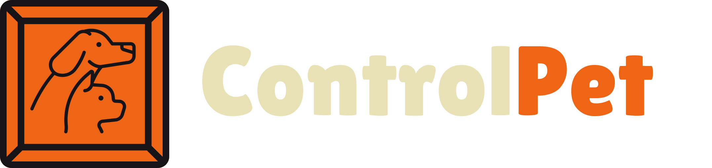

# ControlPet
## Introdução

Projeto criado com o proposito de diminuir ruidos de comunicação entre petshop e cliente final, contendo um painel baseado na métodologia agil kanban, um dashboard de controle total do petshop. Cliente pode contratar serviço via aplicação também e acompanhar o status de preparo de seu bichinho. 

## Techs

Tecnologias usadas para o desenvolvimento do projeto

* HTML
* CSS: Flexbox utilizado em toda estrutura do projeto
* [Bootstrap](https://getbootstrap.com/): Utilizando componentes em partes do código
* [Google Firebase](https://firebase.google.com/?hl=pt): Utilizado na hospedagem do projeto

## Design

O design do projeto foi focado em minimalismo e ser o mais aconchegante o possivel, pois estamos tratando dos nossos melhores amigos, desta forma precisamos repassar da melhor forma possivel toda dedicação e carinho que aplicamos na nossa aplicação.

## Petshop

Na aplicação o petshop terá total controle de entrada e saida dos pets, tendo a maiorias das informações de cadastro do bichinho, como: raça, genero, comportamente, etc. Terá também um controle total sobre métricas, como tempo médio de atendimento de cada pet, funcionarios ativos, pets atendidos no dia, assim como um controle de metas mensais e semanais. Também terá acesso as mesmas métricas separadas por funcionario. 

## Cliente 

No ControlPet o cliente poderá cadastrar seu bichinho, selecionar qual deseja e contratar o serviço. Dentro da aplicação ele terá como contratar 3 serviços, sendo eles: 
* Banho
* Tosa
* Banho e osa

Ele conseguirá também visualizar todas as informações de pós-vendas, tanto do seu pet, quanto do petshop. Aqui na parte de informações do petshop utilizamos um embed do google maps para o cliente localizar de forma mais fácil do endereço. 